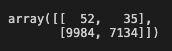

# Credit_Risk_Analysis

## Overview

The purpose of this project was to test several methods of machine learning to determine which model would be the best for predicting high risk loans.

## Results
We tested six different methods of machine learning from the scikit-learn library, below are screenshots of the success from the models that were trained:
### Oversampling

- Accuracy Score: 61.8%

- Confusion Matrix: 7161 False Postives; 30 False Negatives

- Precision: .01
- Recall: .66

### Undersampling

- Accuracy Score: 50.7%

- Confusion Matrix: 9884 Flase Positives; 35 False Negatives

- Precision: .01
- Recall: .6

### SMOTE Oversampling

- Accuracy Score: 63.4%

- Confusion Matrix: 6239 False Postives; 32 False Negatives

- Precision: .01
- Recall: .63

### Combination with SMOTEENN

 - Accuracy Score: 62.0%

- Confusion Matrix: 7696 Flase Positives; 37 False Negatives

- Precision: .01
- Recall: .69

### Balanced Random Forest

- Accuracy Score: 79.0%

- Confusion Matrix: 1879 False Positives; 37 False Negatives

- Precision: .03
- Recall: .69

### Easy Ensemble

- Accuracy Score: 92.6%

- Confusion Matrix: 973 False Postives; 8 False Negatives

- Precision: .08
- Recall: .91

## Summary

As the purpose of this model will be to evaulate the risk levels of loans, it would appear that that `EasyEnsemble` would give us the most accuracy. However, since determining if a loan is high risk is for the purpose of saving money, looking more closeslt at the precision of any of the six models is lacking. All the models score below a .1 on their prevision scores, which would end up with the bank giving several high risk loans. If the reciepents of these unpredicted high risk loands default, the bank will end up losing a lot of money. As none of the precisions attain a reasonable level, it would be unwise to trust any of the models above to predict high risk. In the case of predicting loan risk, False Negatives are more preferable as they are not associated with monetary loss in the same way a False Postive is. A more acceptable model would be one with a higher percision, even if recall is lower.